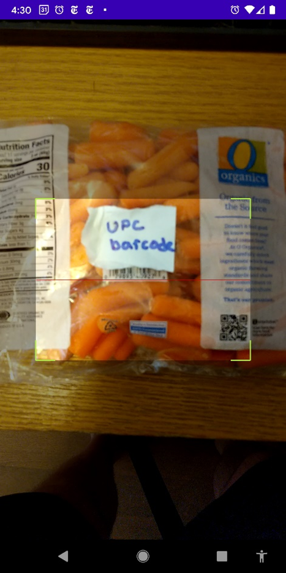

# FoodScan
Use your Android device’s camera to scan UPC barcodes of food products to check ingredients match your dietary preferences.

Purpose

The Food Scan app will allow users to choose labels which describe their dietary restrictions and preferences best. Users will be able to then scan food products, presumably while shopping, to quickly check if that product meets their chosen criteria. Since the application is primarily intended to be used in stores while shopping, design emphasis is put on low power usage and simple, one-handed usability. Note, the app was originally designed to use an OCR framework to extract ingredients from the product&#39;s packaging, further research into the Android Camera and available food databases led to a more elegant solution using a product&#39;s UPC barcode.

Activities, Components, and UI

The user interface consists of two activities, Main and Scan. Both activities are locked to the portrait orientation. Main is locked to this position to promote a firm grip with one hand on your device while shopping. Scan is locked to this position to support the native camera functionality.

The Main activity is set in a RelativeLayout ViewGroup with LinearLayout ViewGroups nested within. This structure is chosen so that the inner layout is statically aligned with groups of like components. Groups of components can then be aligned relative to each other. The final component, a Button to initiate a scan, may be dynamically sized with the remaining screen space. This design allows the application to have the same look and feel with all supported screen types. Maximizing the size of the &quot;SCAN FOOD&quot; button makes it easier on the user to reach while keeping their device secure. Displaying at the top of the Main activity will be a TextView which dynamically reports the status – What product has been scanned or report an error if the product was not found. Below will be a set of 16 CheckBox components for the user to choose their health label preferences. These preferences will be saved between sessions. The listener attached to onClick for all CheckBox components will modify a private ArrayList\&lt;String\&gt; health\_labels. Interaction with a CheckBox will add/remove the relevant health label ID to health\_labels. Upon return from the Scan activity, we search the returned results with the elements in health\_labels. Finally, the CheckBox text will be colorized GREEN if the results match, or RED if the results do not match the corresponding health label ID. Lastly, the single Button component listens for the user input, resets all label and text colors to the default, and initiates the Scan activity.

The Scan requires no UI components, it only uses to native camera View and creates asynchronous threads to process necessary work. Scan activity will keep an SQLite database with columns {UPC, Name, Labels} all of String type. UPC key column is the Universal Product Code embedded into the barcode printed on product packaging, Name is the name of the product, and Labels is a String converted from the elements of an ArrayList\&lt;String\&gt; which elements are the health labels this product qualifies. This database is initially empty as its purpose is to reduce processing and power usage of subsequent repeat scans, avoiding unnecessary network connections and traffic. When the Scan activity is launched, we call the front facing native camera to open without auto focus. ZXing framework will use the device focus functions to find the UPC barcode and extract the Universal Product Code number. This UPC code will be used to query the internal SQLite database to retrieve the product name and the health labels it satisfies. If the query returns with no results, we create a series of two asynchronous threads which make API calls to our food database which retrieve the required information and pass the results to the main thread. The first call is a HTTP GET request which will make a non-persistent HTTP connection to the remote food database to send a query for a product using the UPC number. When the results return, they are passed to the main thread, and this thread is closed. If a valid product was returned to the main thread, we require the second thread to be created for an HTTP POST call to a separate remote database of nutrient information. The HTTP POST call creates a persistent HTTP connection to find all health labels associated with the product name and ingredients list we extracted from the first API call. When the HTTP connection is closed, results are sent to the main thread and this thread is closed. Finally, the main thread parses the information gathered, makes any necessary update to the internal database, passes the results to MainActivity, and finally closes and calls onBackPressed() to return to MainActivity.

  
